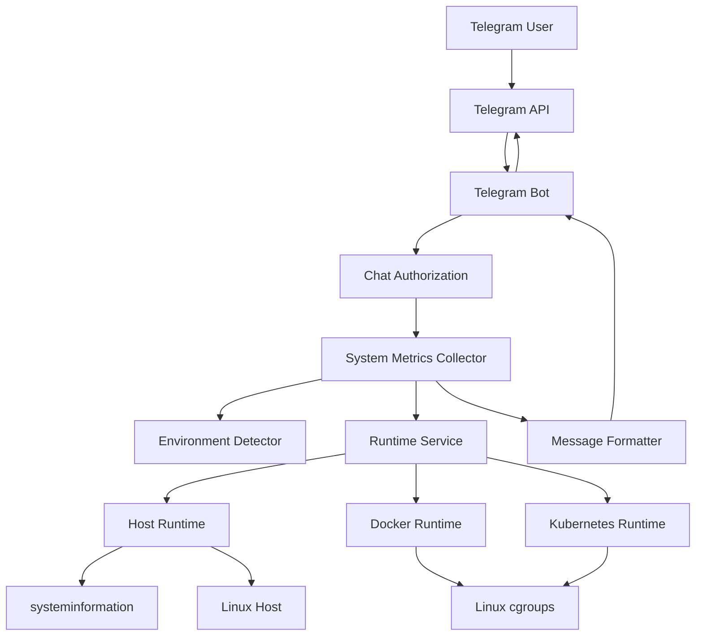
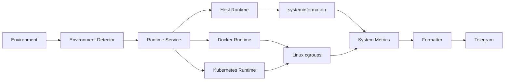
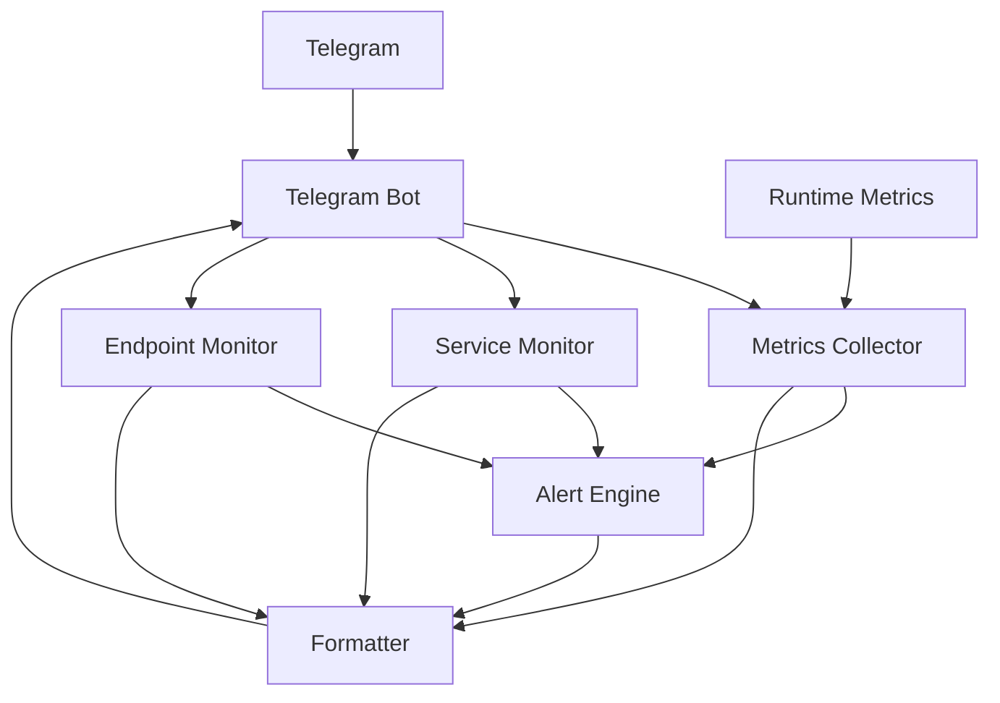

# Server Monitor

A lightweight Linux server monitoring agent built with **Node.js + TypeScript** that collects system and runtime metrics and delivers them through a **Telegram bot**.

The agent is designed to run directly on a Linux host, inside Docker, or inside Kubernetes. Runtime-specific metrics are collected using the appropriate operating-system mechanisms so that containerized applications report their **container/pod resource usage rather than the underlying host's resource usage**.

---

## Table of Contents

- [Overview](#overview)
- [Goals](#goals)
- [Features](#features)
- [Architecture](#architecture)
  - [Architectural Overview](#architectural-overview)
  - [Architecture Diagram](#architecture-diagram)
  - [Runtime Abstraction](#runtime-abstraction)
  - [Environment Detection](#environment-detection)
- [Data Flow](#data-flow)
  - [System Metrics DFD](#system-metrics-dfd)
  - [Telegram Request Flow](#telegram-request-flow)
- [Project Structure](#project-structure)
- [Metrics](#metrics)
  - [CPU](#cpu)
  - [Memory](#memory)
  - [Swap](#swap)
  - [Disk](#disk)
  - [Processes](#processes)
  - [Environment](#environment)
- [Runtime Implementations](#runtime-implementations)
  - [Host](#host)
  - [Docker](#docker)
  - [Kubernetes](#kubernetes)
- [CPU Calculation](#cpu-calculation)
- [Memory Calculation](#memory-calculation)
- [Configuration](#configuration)
- [Telegram Bot](#telegram-bot)
- [Commands](#commands)
- [Installation](#installation)
- [Development](#development)
- [Production](#production)
- [Docker](#docker-1)
- [Kubernetes](#kubernetes-1)
- [Security](#security)
- [Logging](#logging)
- [Error Handling](#error-handling)
- [Performance Considerations](#performance-considerations)
- [Design Decisions](#design-decisions)
- [Current Limitations](#current-limitations)
- [Planned Features](#planned-features)
- [Troubleshooting](#troubleshooting)
- [License](#license)

---

# Overview

`server-monitor` is a small, self-hosted monitoring agent intended for servers and infrastructure where a full monitoring stack such as Prometheus/Grafana would be unnecessary or excessive.

The application runs as a single Node.js process and exposes monitoring information through Telegram.

The same application can run in three environments:

```text
┌──────────────────────────────────────────────┐
│                server-monitor                │
├──────────────────────────────────────────────┤
│                                              │
│  Host Linux                                  │
│  Docker Container                            │
│  Kubernetes Pod                              │
│                                              │
└──────────────────────────────────────────────┘
```

The agent automatically detects its execution environment and selects the appropriate runtime metrics collector.

---

# Goals

The primary goals of the project are:

1. **Lightweight**
   - Minimal dependencies
   - Single Node.js process
   - No database
   - No web server required

2. **Environment aware**
   - Native Linux host
   - Docker
   - Kubernetes

3. **Accurate container metrics**
   - Container memory limits
   - Container CPU limits
   - Container CPU usage
   - Container process count

4. **Simple remote access**
   - Telegram-based interface
   - No public HTTP API required

5. **Production friendly**
   - TypeScript
   - PM2 support
   - Docker support
   - Environment-based configuration
   - Structured logging

6. **Extensible architecture**
   - Runtime abstraction
   - Independent metric collection
   - Independent Telegram presentation
   - Future service and endpoint monitoring
   - Future alerting system

---

# Features

## Currently implemented

- Linux system monitoring
- CPU usage
- CPU load average
- CPU core count
- CPU temperature when available
- RAM usage
- RAM availability
- Swap usage
- Disk usage
- Process count
- Host environment detection
- Docker environment detection
- Kubernetes environment detection
- Docker cgroup v1/v2 support
- Kubernetes cgroup v1/v2 support
- Docker CPU limits
- Kubernetes CPU limits
- Docker memory limits
- Kubernetes memory limits
- Docker process count
- Kubernetes process count
- Telegram bot
- Telegram chat authorization
- Telegram commands
- PM2 production configuration
- Docker image/build configuration
- pnpm support

## Planned

- Service monitoring
- HTTP endpoint monitoring
- TCP health checks
- Alert thresholds
- Consecutive-failure detection
- Recovery notifications
- Alert cooldowns
- Persistent monitoring history
- More detailed Kubernetes metadata
- Resource trend reporting

---

# Architecture

## Architectural Overview

The application follows a layered architecture.

```text
                         ┌─────────────────────┐
                         │      Telegram       │
                         │        User         │
                         └──────────┬──────────┘
                                    │
                                    │ Telegram API
                                    ▼
                         ┌─────────────────────┐
                         │    Telegram Bot     │
                         │                     │
                         │ Command Handling    │
                         │ Authorization       │
                         │ Formatting          │
                         └──────────┬──────────┘
                                    │
                                    ▼
                         ┌─────────────────────┐
                         │   Metrics Layer     │
                         │                     │
                         │ collectSystemMetrics│
                         └──────────┬──────────┘
                                    │
                                    ▼
                         ┌─────────────────────┐
                         │ Runtime Abstraction │
                         └──────────┬──────────┘
                                    │
                   ┌────────────────┼────────────────┐
                   │                │                │
                   ▼                ▼                ▼
             ┌──────────┐     ┌──────────┐    ┌─────────────┐
             │   Host   │     │  Docker  │    │ Kubernetes  │
             │ Runtime  │     │ Runtime  │    │   Runtime   │
             └────┬─────┘     └────┬─────┘    └──────┬──────┘
                  │                │                  │
                  ▼                ▼                  ▼
             systeminformation   cgroups            cgroups
                  │                │                  │
                  └────────────────┼──────────────────┘
                                   ▼
                          ┌──────────────────┐
                          │  System Metrics  │
                          └──────────────────┘
```

The key architectural principle is:

> **The application should not care where it is running when consuming metrics.**

The metrics layer works with a common `RuntimeContext`, while runtime-specific implementations deal with the details of Linux, Docker, or Kubernetes.

---

# Architecture Diagram



---

# Runtime Abstraction

Runtime-specific collection is hidden behind:

```ts
interface RuntimeMetrics {
  cpuUsagePercent: number | null;
  cpuLimitCores: number | null;

  memoryUsageBytes: number | null;
  memoryLimitBytes: number | null;

  processCount: number | null;
}

interface RuntimeContext {
  metrics: RuntimeMetrics;
}
```

The runtime service determines which implementation should be used:

```text
Environment
     │
     ▼
Runtime Service
     │
     ├── host ──────────────► Host Runtime
     │
     ├── docker ────────────► Docker Runtime
     │
     └── kubernetes ────────► Kubernetes Runtime
```

This prevents Docker/Kubernetes-specific logic from leaking into the main metrics collector.

---

# Environment Detection

The environment detector determines whether the process is running on:

```text
host
docker
kubernetes
```

Detection uses several Linux/Kubernetes indicators.

## Kubernetes

The application checks for Kubernetes indicators such as:

```text
KUBERNETES_SERVICE_HOST
/var/run/secrets/kubernetes.io/serviceaccount
```

## Docker

Docker detection checks:

```text
/.dockerenv
/proc/1/cgroup
```

and recognizes cgroup/container identifiers such as:

```text
docker
containerd
kubepods
```

## Detection Priority

Kubernetes is checked before Docker:

```text
Kubernetes
    │
    ├── yes ──► kubernetes
    │
    └── no
         │
         ▼
       Docker
         │
         ├── yes ──► docker
         │
         └── no ───► host
```

This is important because Kubernetes pods frequently run through a container runtime and could otherwise be incorrectly classified as plain Docker.

---

# Data Flow

## System Metrics DFD

The main system-metrics data flow is:



---

# Telegram Request Flow

When a user sends:

```text
/status
```

the flow is:

```text
Telegram User
     │
     │ /status
     ▼
Telegram API
     │
     ▼
Telegram Bot
     │
     ▼
Chat Authorization
     │
     ├── unauthorized ──► ignore/reject
     │
     ▼
Metrics Collector
     │
     ▼
Environment Detector
     │
     ▼
Runtime Service
     │
     ├── Host
     ├── Docker
     └── Kubernetes
     │
     ▼
SystemMetrics
     │
     ▼
Formatter
     │
     ▼
Telegram Bot
     │
     ▼
Telegram API
     │
     ▼
User
```

---

# Project Structure

```text
server-monitor/
│
├── src/
│   │
│   ├── main.ts
│   │
│   ├── config/
│   │   └── ...
│   │
│   ├── environment/
│   │   ├── environment.detector.ts
│   │   ├── environment.service.ts
│   │   └── environment.types.ts
│   │
│   ├── runtime/
│   │   ├── cgroup.utils.ts
│   │   ├── host.runtime.ts
│   │   ├── docker.runtime.ts
│   │   ├── kubernetes.runtime.ts
│   │   ├── runtime.service.ts
│   │   └── runtime.types.ts
│   │
│   ├── metrics/
│   │   └── system.metrics.ts
│   │
│   ├── telegram/
│   │   ├── telegram.bot.ts
│   │   └── ...
│   │
│   └── types/
│       └── metrics.ts
│
├── dist/
│
├── logs/
│
├── Dockerfile
├── ecosystem.config.cjs
├── package.json
├── pnpm-lock.yaml
├── pnpm-workspace.yaml
├── tsconfig.json
├── .env
├── .env.example
└── README.md
```

> The exact contents of individual directories may evolve as additional monitoring modules are implemented.

---

# Metrics

The central `SystemMetrics` object contains:

```ts
interface SystemMetrics {
  hostname: string;
  uptimeSeconds: number;
  processCount: number;

  environment: EnvironmentContext;

  cpu: CpuMetrics;
  memory: MemoryMetrics;

  disks: DiskMetric[];

  collectedAt: Date;
}
```

---

# CPU

CPU metrics include:

```text
Usage percentage
Load average
Host CPU cores
Container/pod CPU limit
CPU temperature
```

Example:

```text
🔥 CPU
Usage: 3.7%
Load: 1.68 / 1.37 / 1.45
Host Cores: 8
Container Limit: 1.00
Temperature: N/A
```

The distinction between host cores and container CPU limit is intentional.

For example:

```text
Host CPU:
8 cores

Container limit:
1 core
```

The application reports both because the process can see the host's CPU topology while being constrained to a smaller cgroup quota.

---

# Memory

Memory metrics include:

```text
Total
Used
Available
Usage percentage
Swap total
Swap used
Swap usage percentage
```

For containerized environments, memory values come from cgroups.

Example:

```text
🧠 RAM
Usage: 6.3%
32.46 MB / 512.00 MB
Available: 479.54 MB
```

This means:

```text
Container usage = 32.46 MB

Container limit = 512 MB
```

rather than reporting the entire Kubernetes node's memory.

---

# Swap

Swap metrics currently come from the host-level system information source.

Example:

```text
🔄 SWAP
Usage: 0.2%
2.01 MB / 1.00 GB
```

Swap is generally a host-level resource rather than a normal Kubernetes pod resource.

---

# Disk

Disk information is collected for configured filesystem mount points.

Each disk contains:

```ts
interface DiskMetric {
  filesystem: string;
  mount: string;

  totalBytes: number;
  usedBytes: number;
  availableBytes: number;

  usagePercent: number;
}
```

Example:

```text
Filesystem: /dev/sda1
Mount: /
Usage: 41.2%
```

The configured filesystem list determines which mounts are reported.

---

# Processes

Process count is runtime-aware.

On a host:

```text
systeminformation
```

is used.

Inside Docker/Kubernetes:

```text
pids.current
```

is read from the relevant cgroup.

This prevents the agent from reporting the entire host's process count when it is supposed to describe a container or pod.

---

# Environment

The monitoring output identifies the execution environment.

## Host

```text
🖥 hostname
```

## Docker

```text
🐳 Docker — hostname
📦 Container: 4cf719d60050
```

## Kubernetes

```text
☸️ Kubernetes
📦 Pod: server-monitor-test
```

Additional Kubernetes metadata can include:

```text
Namespace
Node
```

when available.

---

# Runtime Implementations

## Host Runtime

The host runtime uses `systeminformation`.

It collects:

```text
CPU
Memory
Processes
```

The host memory usage is calculated using:

```text
used = total - available
```

rather than simply using the Linux `used` field.

This better reflects memory actively unavailable to applications because Linux filesystem cache and reclaimable memory can otherwise make the raw `used` value appear significantly higher.

---

# Docker Runtime

Docker metrics are collected through Linux cgroups.

The implementation supports:

```text
cgroup v1
cgroup v2
```

For cgroup v2, relevant files include:

```text
memory.current
memory.max
cpu.stat
cpu.max
pids.current
```

For cgroup v1, the equivalent controller files are used.

Architecture:

```text
Docker Container
      │
      ▼
Linux cgroup
      │
      ├── memory.current
      ├── memory.max
      ├── cpu.stat
      ├── cpu.max
      └── pids.current
      │
      ▼
Docker Runtime
      │
      ▼
RuntimeMetrics
```

---

# Kubernetes Runtime

Kubernetes runtime metrics use the same cgroup abstraction.

The Kubernetes runtime:

1. Detects cgroup version.
2. Resolves the current cgroup path.
3. Reads resource usage.
4. Reads resource limits.
5. Calculates CPU usage.
6. Reads process count.
7. Returns normalized `RuntimeMetrics`.

Example:

```text
Pod CPU limit:
1 CPU

Pod memory limit:
512 MiB

Pod process count:
11
```

---

# cgroup v2

The unified hierarchy commonly appears as:

```text
0::/
```

The implementation recognizes this as:

```text
unified
```

CPU quota is read from:

```text
cpu.max
```

For example:

```text
100000 100000
```

means:

```text
quota  = 100000 µs
period = 100000 µs

CPU limit = 100000 / 100000
          = 1 CPU
```

Memory limit is read from:

```text
memory.max
```

Usage is read from:

```text
memory.current
```

---

# CPU Calculation

CPU usage is calculated from two cumulative CPU usage samples.

For cgroup v2:

```text
usage_usec
```

is read from:

```text
cpu.stat
```

The application stores:

```text
previous usage
previous timestamp
```

Then:

```text
usage delta =
    current usage
    - previous usage
```

and:

```text
time delta =
    current timestamp
    - previous timestamp
```

CPU consumption relative to one CPU is approximately:

```text
CPU = usage_delta / time_delta
```

When a CPU limit exists, usage is normalized against the limit:

```text
normalized CPU =
    usage of one CPU
    / CPU limit
```

and converted to a percentage.

For example:

```text
CPU limit = 1.0

Actual CPU consumption = 0.25 CPU

Usage = 25%
```

The first sample intentionally returns no CPU percentage because there is no previous sample against which to calculate a delta.

---

# Memory Calculation

For containerized environments:

```text
usagePercent =
    memoryUsageBytes /
    memoryLimitBytes *
    100
```

Available memory is:

```text
available =
    memoryLimit -
    memoryUsage
```

For example:

```text
Limit:
512 MB

Usage:
32 MB

Available:
480 MB

Usage:
6.25%
```

---

# Configuration

Configuration is supplied through environment variables.

Create:

```text
.env
```

from:

```text
.env.example
```

Example:

```env
NODE_ENV=production

TELEGRAM_BOT_TOKEN=your_bot_token
TELEGRAM_CHAT_ID=your_chat_id
```

Additional configuration options can be added as the monitoring system grows.

---

# Telegram Bot

The Telegram integration uses polling.

The bot receives commands through the Telegram Bot API and responds with formatted monitoring information.

Authentication is intentionally simple:

```text
Incoming Telegram message
            │
            ▼
      Extract chat ID
            │
            ▼
Compare with TELEGRAM_CHAT_ID
            │
      ┌─────┴─────┐
      │           │
   Allowed      Denied
      │           │
      ▼           ▼
 Process       Reject
 command
```

Only the configured Telegram chat ID is authorized to interact with the monitoring bot.

---

# Commands

## `/status`

Returns a human-readable server status summary.

Example:

```text
☸️ Kubernetes
📦 Pod: server-monitor-test

⏱️ Uptime: 3h 7m

🔥 CPU
Usage: 3.7%
Load: 1.68 / 1.37 / 1.45
Host Cores: 8
Container Limit: 1.00
Temperature: N/A

🧠 RAM
Usage: 6.3%
32.46 MB / 512.00 MB
Available: 479.54 MB

🔄 SWAP
Usage: 0.2%
2.01 MB / 1.00 GB

⚙️ Processes: 11
```

## `/metrics`

Returns system metrics.

## `/services`

Reserved for the service monitoring subsystem.

## `/disk`

Returns disk-related information.

## `/help`

Displays available commands.

---

# Installation

## Requirements

- Linux host for production monitoring
- Node.js `>= 20`
- pnpm `12.x`
- Telegram bot token
- Telegram chat ID

Check versions:

```bash
node --version
pnpm --version
```

---

# Install Dependencies

```bash
pnpm install
```

---

# Development

Run the application in watch mode:

```bash
pnpm dev
```

---

# Type Checking

```bash
pnpm typecheck
```

---

# Build

```bash
pnpm build
```

The compiled application is generated in:

```text
dist/
```

---

# Start

```bash
pnpm start
```

---

# Lint

```bash
pnpm lint
```

---

# Production

The project includes a PM2 configuration:

```text
ecosystem.config.cjs
```

Build the application:

```bash
pnpm build
```

Start with PM2:

```bash
pm2 start ecosystem.config.cjs
```

Save the PM2 process list:

```bash
pm2 save
```

Check status:

```bash
pm2 status
```

View logs:

```bash
pm2 logs server-monitor
```

---

# PM2 Architecture

```text
                  Linux Server
                       │
                       ▼
                  PM2 Runtime
                       │
                       ▼
              server-monitor process
                       │
          ┌────────────┼────────────┐
          │            │            │
          ▼            ▼            ▼
       Metrics      Telegram      Logging
       Collector      Bot
```

The application is configured as a single forked PM2 process.

The configuration also provides:

- automatic restart
- restart delay
- memory restart threshold
- combined logs
- separate stdout/stderr files

---

# Docker

The project contains a root-level:

```text
Dockerfile
```

The Docker image uses Node.js Alpine and pnpm.

Build:

```bash
docker build -t server-monitor:local .
```

Run:

```bash
docker run -d \
  --name server-monitor \
  --env-file .env \
  server-monitor:local
```

View logs:

```bash
docker logs -f server-monitor
```

Stop:

```bash
docker stop server-monitor
```

Remove:

```bash
docker rm server-monitor
```

---

# Docker Resource Limits

When running with explicit limits:

```bash
docker run -d \
  --name server-monitor \
  --memory=512m \
  --cpus=1 \
  --env-file .env \
  server-monitor:local
```

the application can report:

```text
Container Limit: 1.00
RAM: 512 MB
```

rather than using the host's total CPU and RAM as its resource boundary.

---

# Kubernetes

The application can also run as a Kubernetes Pod.

A typical deployment should define resource requests and limits:

```yaml
resources:
  requests:
    cpu: "500m"
    memory: "256Mi"

  limits:
    cpu: "1"
    memory: "512Mi"
```

The monitoring agent can then report the pod's cgroup resource limits.

Conceptually:

```text
Kubernetes Node
│
├── Pod
│   │
│   └── server-monitor
│       │
│       └── cgroup
│           ├── CPU limit
│           ├── Memory limit
│           └── Process limit
│
└── Other workloads
```

---

# Kubernetes Metadata

When available, the application identifies:

```text
Pod name
Namespace
Node name
```

These values can be supplied through Kubernetes environment variables.

Typical values are:

```text
POD_NAME
POD_NAMESPACE
NODE_NAME
```

`HOSTNAME` may also be used as a fallback for the pod name.

---

# Security

## Telegram Authorization

The bot does not accept commands from arbitrary Telegram chats.

Incoming messages are checked against:

```env
TELEGRAM_CHAT_ID
```

## Secrets

Never commit:

```text
.env
```

or Kubernetes manifests containing real Telegram credentials.

Use:

```text
.env.example
```

for documentation.

Example:

```env
TELEGRAM_BOT_TOKEN=
TELEGRAM_CHAT_ID=
```

Real credentials should only exist in the deployment environment.

---

# Logging

The application uses logging for runtime diagnostics and operational information.

PM2 writes logs to:

```text
logs/server-monitor.out.log
logs/server-monitor.error.log
```

Runtime-specific diagnostics can identify:

```text
cgroup version
cgroup path
CPU usage
CPU limit
memory usage
memory limit
process count
```

Example diagnostic information:

```text
[kubernetes-runtime] metrics:
{
  version: 2,
  cgroupPath: "...",
  cpuUsageUsec: 2937892,
  cpuLimitCores: 1,
  memoryUsage: 34746368,
  memoryLimit: 536870912,
  processCount: 11
}
```

These diagnostics are particularly useful when validating the agent inside different container runtimes.

---

# Error Handling

The monitoring architecture intentionally treats individual metric failures as nullable values instead of allowing one unavailable metric to terminate the entire collection operation.

For example:

```ts
cpuTemperature: null;
```

means temperature information was unavailable.

Similarly:

```ts
cpuLimitCores: null;
```

means no CPU limit could be determined.

This allows the monitor to continue operating across different Linux environments and kernel configurations.

---

# Performance Considerations

The project is intentionally designed to have a small runtime footprint.

## Parallel Collection

Independent system information requests are collected concurrently.

Conceptually:

```text
                 ┌── Memory
                 │
Metrics Request ─┼── CPU Temperature
                 │
                 ├── Filesystem
                 │
                 ├── System Time
                 │
                 └── Runtime Metrics
```

This avoids unnecessarily serializing independent I/O operations.

## No Database

The current implementation does not require:

- MySQL
- PostgreSQL
- Redis
- MongoDB

This keeps deployment simple and minimizes resource consumption.

## No HTTP Server

The current Telegram-based architecture does not require an exposed HTTP port.

This reduces:

- attack surface
- configuration
- reverse-proxy requirements
- TLS requirements

---

# Design Decisions

## Why TypeScript?

TypeScript provides:

- explicit metric contracts
- runtime abstraction interfaces
- safer configuration handling
- easier future module expansion
- better maintainability

---

## Why `systeminformation`?

`systeminformation` provides a convenient cross-platform abstraction for host-level system information.

It is particularly useful for:

- CPU information
- memory
- filesystem information
- temperature
- process information
- system uptime

However, it is not relied upon for container resource boundaries.

---

## Why cgroups?

Container resource limits are controlled by Linux cgroups.

Using cgroups allows the application to distinguish:

```text
Host resources
```

from:

```text
Container/pod resources
```

For example:

```text
Host:
16 GB RAM

Container:
512 MB RAM limit
```

A host-level memory API alone cannot reliably represent the container's configured resource boundary.

---

## Why a Runtime Abstraction?

Without the abstraction, the metrics collector would contain logic such as:

```text
if Docker:
    read cgroup

if Kubernetes:
    read cgroup

if Host:
    use systeminformation
```

throughout the application.

Instead:

```text
System Metrics
      │
      ▼
Runtime Service
      │
      ├── Host Runtime
      ├── Docker Runtime
      └── Kubernetes Runtime
```

Each implementation owns its environment-specific behavior.

---

# Current Limitations

## Load Average

Load average currently comes from the operating system and may represent the underlying host rather than an isolated container/pod workload.

This is especially relevant when running Kubernetes through Docker Desktop.

---

## Swap

Swap metrics are currently host-level.

Containerized environments generally do not expose swap as an equivalent pod resource metric.

---

## CPU Temperature

CPU temperature is not available in many virtualized or containerized environments.

Therefore:

```text
Temperature: N/A
```

is expected in those environments.

---

## Kubernetes Node Information

The application can display node information when it is supplied to the pod, but it does not currently communicate with the Kubernetes API to discover cluster-wide information.

This is intentional.

The current Kubernetes implementation is based on local runtime/cgroup information rather than Kubernetes API access.

---

## Persistence

The current application does not persist historical metrics.

Metrics represent the current state at collection time.

---

# Planned Features

The architecture is designed to support additional monitoring capabilities.

## Service Monitoring

Planned service types:

```text
systemd
TCP
HTTP
```

The existing model supports:

```ts
type ServiceType = "systemd" | "tcp" | "http";
```

A service status contains:

```ts
interface ServiceStatus {
  name: string;
  type: ServiceType;
  healthy: boolean;

  systemdState?: string;

  host?: string;
  port?: number;

  url?: string;
  statusCode?: number | null;

  responseTimeMs?: number | null;

  error?: string;
}
```

---

# Endpoint Monitoring

HTTP endpoints will be monitored using:

```text
URL
HTTP status
Response time
Health state
Error information
```

The resulting model is:

```ts
interface EndpointStatus {
  name: string;
  url: string;

  healthy: boolean;

  statusCode: number | null;
  responseTimeMs: number | null;

  error?: string;
}
```

---

# Alerting

The project already defines the conceptual alert state model:

```ts
interface AlertState {
  active: boolean;

  consecutiveFailures: number;

  lastAlertAt: number;

  lastValue: number | null;
}
```

Supported metric categories are intended to include:

```text
CPU
RAM
Swap
Disk
Load
Temperature
```

The intended alert lifecycle is:

```text
Normal
  │
  │ threshold exceeded
  ▼
Failure
  │
  │ consecutive failures
  ▼
Alert Active
  │
  │ recovery detected
  ▼
Recovered
  │
  ▼
Normal
```

This prevents transient spikes from generating excessive notifications.

---

# Future Architecture

As service monitoring and alerting are added, the architecture is expected to evolve toward:



This keeps the alert engine independent of how metrics are collected.

---

# Monitoring Model

The long-term conceptual monitoring model is:

```text
                     server-monitor
                           │
             ┌─────────────┼─────────────┐
             │             │             │
             ▼             ▼             ▼
          System        Services      Endpoints
          Metrics       Health         Health
             │             │             │
             └─────────────┼─────────────┘
                           ▼
                     Alert Engine
                           │
                           ▼
                       Telegram
```

---

# Operational Workflow

A typical production deployment looks like:

```text
┌──────────────────────┐
│      Linux Server    │
│                      │
│   ┌──────────────┐   │
│   │     PM2      │   │
│   │              │   │
│   │ server-      │   │
│   │ monitor      │   │
│   └──────┬───────┘   │
│          │           │
│          │ metrics   │
│          ▼           │
│   ┌──────────────┐   │
│   │ Linux /      │   │
│   │ cgroups      │   │
│   └──────────────┘   │
│                      │
└──────────┬───────────┘
           │
           │ HTTPS / Telegram API
           ▼
     ┌──────────────┐
     │   Telegram   │
     └──────┬───────┘
            │
            ▼
          User
```

---

# Troubleshooting

## Telegram Bot Does Not Respond

Check:

```bash
pm2 status
```

Then:

```bash
pm2 logs server-monitor
```

Verify:

```env
TELEGRAM_BOT_TOKEN
TELEGRAM_CHAT_ID
```

Also verify that the Telegram chat ID matches the configured authorized chat.

---

## CPU Shows `0%` or `N/A` Initially

The runtime CPU collector requires two samples.

The first sample establishes the baseline:

```text
Sample 1
    │
    └── baseline only

Sample 2
    │
    └── calculate delta
```

Therefore the first collection may not have a meaningful CPU percentage.

---

## Docker Reports Host Memory

Verify that the application is using the Docker runtime:

```text
🐳 Docker
```

and that cgroup files are available.

For cgroup v2:

```bash
cat /sys/fs/cgroup/memory.current
cat /sys/fs/cgroup/memory.max
cat /sys/fs/cgroup/cpu.stat
cat /sys/fs/cgroup/cpu.max
```

---

## Kubernetes Reports Host Memory

Verify:

```text
☸️ Kubernetes
```

is detected.

Then inspect:

```bash
cat /proc/self/cgroup
```

and:

```bash
cat /sys/fs/cgroup/memory.current
cat /sys/fs/cgroup/memory.max
cat /sys/fs/cgroup/cpu.stat
cat /sys/fs/cgroup/cpu.max
```

The pod should also have resource limits configured.

---

## Container CPU Limit Is `N/A`

A missing CPU limit is normally represented as:

```text
Container Limit: N/A
```

or:

```text
cpuLimitCores: null
```

This can happen when no CPU quota is configured.

For cgroup v2:

```text
cpu.max
```

may contain:

```text
max
```

which means no CPU quota is configured.

---

# Development Guidelines

When adding a new runtime implementation:

1. Implement `RuntimeContext`.
2. Do not change the public metrics model unnecessarily.
3. Keep runtime-specific filesystem logic inside the runtime module.
4. Reuse `cgroup.utils.ts` for cgroup access.
5. Return `null` when a metric cannot be determined.
6. Avoid making the Telegram layer aware of runtime implementation details.

The preferred dependency direction is:

```text
Telegram
   │
   ▼
Metrics
   │
   ▼
Runtime
   │
   ▼
OS / cgroups / systeminformation
```

Runtime implementations should not depend on Telegram formatting.

---

# Dependency Overview

The main runtime dependencies are:

```text
dotenv
    Environment configuration

node-telegram-bot-api
    Telegram integration

pino
    Logging

systeminformation
    Host system information
```

Development dependencies include:

```text
TypeScript
tsx
ESLint
TypeScript ESLint
Node.js types
```

---

# Build Pipeline

The production build process is:

```text
TypeScript Source
       │
       ▼
   TypeScript
    Compiler
       │
       ▼
      dist/
       │
       ▼
 Node.js Runtime
       │
       ▼
 server-monitor
```

Docker follows:

```text
Source
  │
  ▼
Docker Build
  │
  ├── Install dependencies
  ├── Compile TypeScript
  └── Produce image
  │
  ▼
Docker Container
  │
  ▼
server-monitor
```

---

# Repository Hygiene

The following should not be committed:

```text
node_modules/
dist/
.env
logs/
*.log
```

Temporary Kubernetes testing manifests containing credentials should also never be committed.

For example:

```text
k8s-test.yaml
```

should be removed after local testing if it contains environment-specific secrets.

---

# Production Checklist

Before deploying:

- [ ] Node.js >= 20 installed
- [ ] Dependencies installed with pnpm
- [ ] `.env` configured
- [ ] Telegram bot token configured
- [ ] Telegram chat ID configured
- [ ] Application builds successfully
- [ ] TypeScript typecheck passes
- [ ] PM2 configured
- [ ] Logs directory available
- [ ] Telegram bot responds
- [ ] Environment is correctly detected
- [ ] CPU metrics are valid
- [ ] Memory metrics are valid
- [ ] Disk metrics are valid
- [ ] No secrets committed to Git

---

# Example Output

## Host

```text
🖥 hostname

⏱ Uptime: 2d 4h

🔥 CPU
Usage: 8.4%
Load: 0.42 / 0.38 / 0.31
Host Cores: 8
Temperature: 47.0°C

🧠 RAM
Usage: 34.2%
5.53 GB / 16.37 GB
Available: 10.83 GB

🔄 SWAP
Usage: 0.0%
0 B / 0 B

⚙️ Processes: 214
```

## Docker

```text
🐳 Docker — 4cf719d60050

⏱ Uptime: 1h 34m

🔥 CPU
Usage: 3.2%
Load: 0.12 / 0.03 / 0.01
Host Cores: 8
Container Limit: 1.00
Temperature: N/A

🧠 RAM
Usage: 7.1%
36.47 MB / 512.00 MB
Available: 475.53 MB

🔄 SWAP
Usage: 0.0%
0 B / 1.00 GB

⚙️ Processes: 11
```

## Kubernetes

```text
☸️ Kubernetes
📦 Pod: server-monitor-test

⏱ Uptime: 3h 7m

🔥 CPU
Usage: 3.7%
Load: 1.68 / 1.37 / 1.45
Host Cores: 8
Container Limit: 1.00
Temperature: N/A

🧠 RAM
Usage: 6.3%
32.46 MB / 512.00 MB
Available: 479.54 MB

🔄 SWAP
Usage: 0.2%
2.01 MB / 1.00 GB

⚙️ Processes: 11
```

---

# Summary

`server-monitor` is intentionally built around a small number of clearly separated responsibilities:

```text
                    ┌─────────────────┐
                    │    Telegram     │
                    └────────┬────────┘
                             │
                             ▼
                    ┌─────────────────┐
                    │   Bot / Auth    │
                    └────────┬────────┘
                             │
                             ▼
                    ┌─────────────────┐
                    │ Metrics Layer   │
                    └────────┬────────┘
                             │
                             ▼
                    ┌─────────────────┐
                    │ Runtime Layer   │
                    └────────┬────────┘
                             │
              ┌──────────────┼──────────────┐
              │              │              │
              ▼              ▼              ▼
            Host           Docker       Kubernetes
              │              │              │
              ▼              ▼              ▼
       systeminformation   cgroups       cgroups
```

The architecture deliberately separates **what is being monitored** from **how the underlying environment exposes those resources**.

That separation allows the same monitoring application to run directly on Linux, inside Docker, or inside Kubernetes without changing the higher-level metrics and Telegram interfaces.

---

# License

Add the project's license here when one is selected.

For example:

```text
MIT License
```

or replace this section with the project's chosen license.
